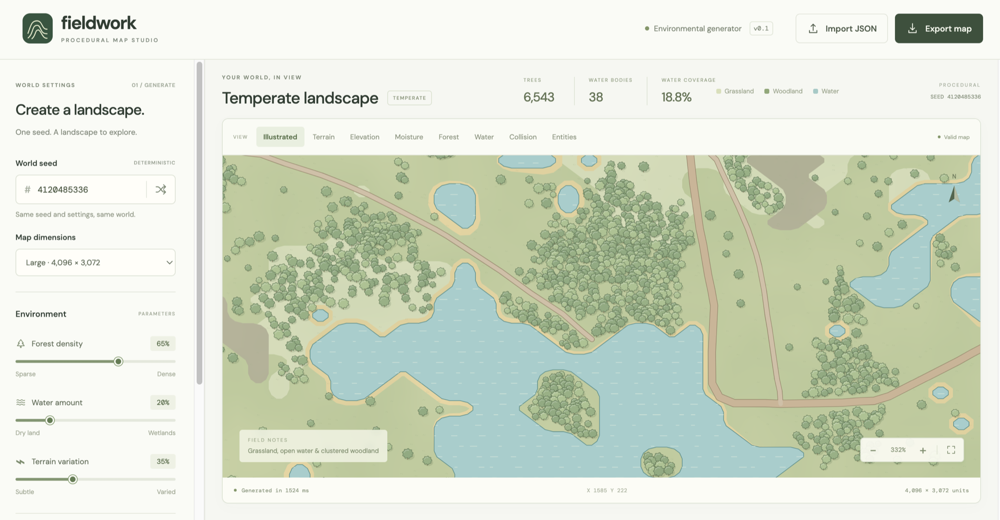

# Procedural Map Generator



A procedural map generator for games and other projects. It started as a way to get good-looking maps generated from a seed for a game I was building, and it is general enough for any project that needs a world. The work is inspired by [Watabou](https://watabou.github.io), which showed what this kind of tool can do. Thanks.

`fieldwork-map` creates deterministic, semantic `GameMap` worlds. It is a Node ESM library with no DOM dependency and no runtime dependencies. The repository also includes a browser map studio for generation, import/export, and debug views.

## Install

From a git checkout, which builds the library on install:

```sh
npm install github:kinged007/procedural-map
```

From a published tarball:

```sh
npm install fieldwork-map
```

A git install runs the `prepare` script, so `dist/` is built for you and you do not need a global
TypeScript. Only `dist/` ships in the tarball, about 55KB.

## Setup

Requires Node.js 22.12 or later.

```sh
npm install
npm run dev
```

`npm run dev` starts the browser studio. Run the full local quality gate with:

```sh
npm run check
```

It runs formatting, linting, type checking, tests, and the demo build.

The same gate runs automatically before every commit, via the hook in `.githooks/`. `core.hooksPath` is set in this repository's git config. Because that setting lives in `.git/config` rather than in a tracked file, a fresh clone needs it enabled once:

```sh
git config core.hooksPath .githooks
```

Build outputs are `dist/` for the library and `dist-demo/` for the browser studio:

```sh
npm run build
```

## Library

Build the library before running Node code against `dist/`.

```js
import { exportMap, generateMap, importMap, validateMap } from './dist/index.js';

const map = generateMap({
  seed: 583921,
  width: 2048,
  height: 1536,
  water: { amount: 0.2 },
  vegetation: { density: 0.65, clustering: 0.8 },
  roads: { density: 0.5 },
});

const json = exportMap(map);
const restored = importMap(json);
const result = validateMap(restored);

if (!result.valid) throw new Error(result.errors.join('; '));
```

`generateMap(config)` returns a validated, deterministic `GameMap`. `exportMap(map)` returns canonical JSON, `importMap(jsonOrObject)` validates and clones native canonical maps, and `validateMap(value)` returns `{ valid, errors }`.

For a per-frame movement check, bake the walkability grid once and read a byte per cell:

```js
import {
  generateMap,
  rasterizeWalkability,
  chunkTile,
  navigableRegions,
  spawnCandidates,
} from 'fieldwork-map';

const raster = rasterizeWalkability(map, { cellSize: 32 });
const chunk = chunkTile(raster, map, chunkX, chunkY, { chunkSize: 32 });
chunk[y * chunkSize + x]; // 0 open, 1 blocked

navigableRegions(raster); // the areas a character can walk between
spawnCandidates(raster, map, { count: 8, minSeparation: 200 });
```

A cell is blocked if any part of it is covered by water or rock. The rule is stated, with its
consequences, in [Consuming generated maps](docs/consuming-maps.md).

The Canvas renderer is available from the `fieldwork-map/rendering` subpath. Supply it with an HTML canvas and either the built-in `defaultTheme` or a custom `MapTheme`.

```js
import { CanvasRenderer } from 'fieldwork-map/rendering';
import { defaultTheme } from 'fieldwork-map';

const renderer = new CanvasRenderer(document.querySelector('canvas'));
renderer.render(map, { theme: defaultTheme, view: 'styled' });
```

## Documentation

| Document                                           | What it covers                                                                                                                                                      |
| -------------------------------------------------- | ------------------------------------------------------------------------------------------------------------------------------------------------------------------- |
| [Consuming generated maps](docs/consuming-maps.md) | **Start here if you are consuming a map in a game.** What the generator produces, what it expects your engine to do, cost and limits, and what is not produced yet. |
| [GameMap v1.0 schema](docs/gamemap-schema.md)      | Field-by-field structure of the exported JSON, with worked examples taken from a real generated map, and every validation rule.                                     |
| [Generation](docs/generation.md)                   | How each layer is produced: fields, water, terrain classification, vegetation, and roads, and how the controls affect the result.                                   |
| [Architecture](docs/architecture.md)               | Where the product boundary sits and how the modules divide up.                                                                                                      |
| [PRD](../PRD.md)                                   | Requirements, design principles, and the roadmap.                                                                                                                   |
